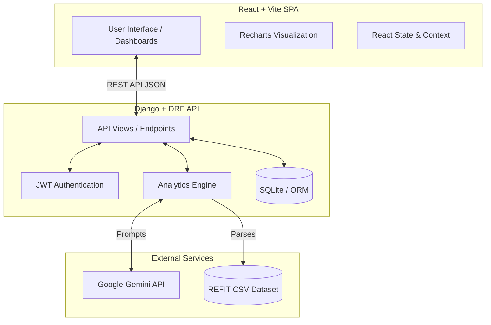
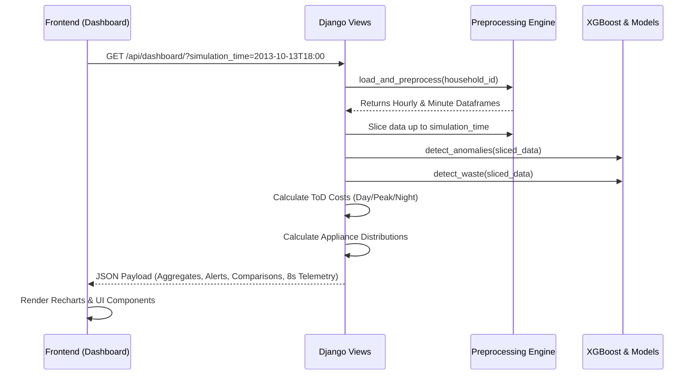
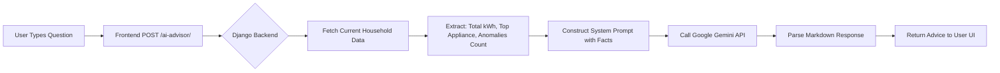

# Enerza - Intelligent Energy Management System

Enerza is an advanced, AI-powered Smart Home Energy Management System. It leverages real-world smart meter data (REFIT dataset), machine learning forecasting, and generative AI to provide homeowners with deep insights into their energy consumption, identify phantom loads, and automate appliance control to maximize financial savings.

---

## 🌟 Key Features

* **Historical Replay & Live Telemetry**: Simulates real-time 8-second interval power fluctuations using the extensive REFIT dataset, giving users a "live" view of their historic energy consumption.
* **Time-of-Day (ToD) Tariff Analysis**: Automatically buckets energy consumption into Day (Discounted), Peak (Premium), and Night (Standard) blocks (based on KSEB models) to accurately calculate estimated costs.
* **Interactive Comparison Engine**: Dynamic tabs to compare usage across Time of Day, Day-vs-Day, Month-vs-Month, and Appliance-vs-Appliance.
* **AI Advisor (Powered by Google Gemini)**: A conversational AI assistant that understands your real-time energy profile, detects top energy-draining appliances, and provides actionable optimization strategies.
* **Anomaly & Waste Detection**: Algorithmically detects abnormal consumption spikes and phantom loads (devices left on idle), alerting the user and calculating potential savings.
* **XGBoost Forecasting**: Predictive analytics that forecasts future energy consumption based on historical trends, time of day, and appliance usage patterns.
* **IoT Appliance Control & Auto-Trip**: Simulates remote IoT control over individual appliances. Users can set maximum Wattage or kWh limits per appliance; if exceeded, the system automatically trips the power state to "OFF" for safety and savings.
* **Multi-Household Architecture**: Admin dashboard for assigning distinct REFIT household datasets to individual user accounts, ensuring complete data isolation.

---

## 🏗️ System Architecture & Data Flow

Enerza is built on a decoupled architecture, utilizing a robust Django backend for heavy data processing and a lightning-fast React frontend for data visualization.

### 1. High-Level Architecture



### 2. Analytics Pipeline & Data Processing Flow

When a user requests their dashboard for a specific simulated time, the backend processes millions of data points on the fly.



### 3. AI Advisor Interaction Flow

The AI Advisor dynamically injects the user's real-time energy context into the LLM prompt.



---

## 🛠️ Technology Stack

### Frontend (Client-Side)
* **Framework**: React 18 + Vite
* **Styling**: Tailwind CSS (with custom Glassmorphism aesthetics)
* **Charting**: Recharts (Responsive D3-based charts)
* **Icons**: Lucide React
* **Routing**: React Router DOM

### Backend (Server-Side)
* **Framework**: Django 5 + Django REST Framework (DRF)
* **Data Processing**: Pandas, NumPy
* **Machine Learning**: XGBoost, Scikit-learn
* **Authentication**: SimpleJWT (JSON Web Tokens)
* **AI Integration**: `google-genai` SDK

---

## 🚀 Getting Started

### Prerequisites
* Node.js (v18+)
* Python (3.10+)
* REFIT Dataset (CLEAN_REFIT_081116) placed in the `data/` directory.

### 1. Backend Setup
```bash
cd backend
python -m venv venv
source venv/bin/activate  # On Windows: venv\Scripts\activate
pip install -r requirements.txt

# Environment Variables (.env)
# Create a .env file in the backend directory:
# GEMINI_API_KEY=your_google_gemini_api_key

# Run Migrations
python manage.py migrate

# Start Server
python manage.py runserver
```

### 2. Frontend Setup
```bash
cd frontend
npm install
npm run dev
```

### 3. Data Seeding
To initialize the REFIT households in the database:
```bash
cd backend
python manage.py seed_refit_households
```

---

## 🌍 Production Deployment

Enerza is fully decoupled and ready for production deployment using industry-standard configurations.

### 1. Docker & Docker Compose (Recommended)
You can deploy the entire stack (Frontend, Backend, and PostgreSQL) on any VPS using the provided `docker-compose.prod.yml`.

```bash
# Set your production secrets in the environment
export SECRET_KEY="your-secure-secret"
export GEMINI_API_KEY="your-gemini-key"

# Build and start all services in detached mode
docker-compose -f docker-compose.prod.yml up --build -d
```
*Note: The frontend will be served on port `80` via an optimized Nginx container, and the Django backend on port `8000` via Gunicorn.*

### 2. Deploying on Render (Infrastructure-as-Code)
We provide a `render.yaml` Blueprint to fully automate deployment on [Render.com](https://render.com).
1. Fork or push this repository to GitHub.
2. In the Render Dashboard, click **New > Blueprint**.
3. Connect your repository.
4. Render will automatically provision a PostgreSQL database, deploy the Django backend (applying migrations), and deploy the Vite React frontend globally on their CDN.

### 3. Deploying on Vercel
A `vercel.json` is included in the project root to support deploying the monorepo (both the Vite React frontend and Django backend) directly on Vercel.
1. Install the Vercel CLI or connect your GitHub repository to Vercel.
2. The `vercel.json` automatically routes `/api/*` traffic to the backend service and all other traffic to the frontend service.
3. Ensure you set `SECRET_KEY`, `GEMINI_API_KEY`, and `DATABASE_URL` in your Vercel project settings.

### 4. Deploying on Heroku
A `Procfile` is included for easy PaaS deployment.
```bash
heroku create enerza-backend
heroku config:set SECRET_KEY="your-secret" GEMINI_API_KEY="your-key" ALLOWED_HOSTS="enerza-backend.herokuapp.com"
git push heroku main
heroku run python manage.py migrate
```

---

## 📂 Project Structure

```text
Enerza/
├── backend/                  # Django REST API
│   ├── api/                  # Core application
│   │   ├── analytics/        # Core Data Science logic
│   │   │   ├── ai_advisor.py         # Gemini Integration
│   │   │   ├── anomaly_detection.py  # Z-score Anomaly engine
│   │   │   ├── forecasting.py        # XGBoost Time-Series models
│   │   │   ├── preprocessing.py      # Pandas DataFrame loaders
│   │   │   └── waste_detection.py    # Phantom load algorithms
│   │   ├── management/       # Custom Django CLI Commands
│   │   ├── models.py         # DB Schemas (Users, IoT Settings, Households)
│   │   └── views.py          # API Endpoints
│   └── enerza/               # Django Settings & Routing
├── frontend/                 # React Vite App
│   ├── src/
│   │   ├── components/       # Reusable UI (Sidebar, Layouts)
│   │   ├── pages/            # Page Views (Dashboard, Insights, Forecast, Alerts)
│   │   └── services/         # Axios API clients
└── data/                     # Local storage for CSV datasets
```
